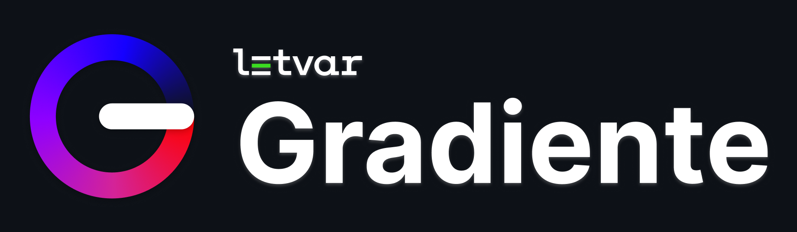

**Gradiente** is a simple library for iOS to apply a blurry, coloured and vibrant background behind your views. It's written in SwiftUI and easily applicable to any view.

# Features

- Support for colours and gradients
- Can be applied as a SwiftUI modifier to any view
- Can be positioned at the top or bottom of the view
- Compatible with iOS 15

# Requirements
- Xcode 13 and later
- iOS 15 and later
- Swift 5.5 and later

# Installation

To install this Swift package into your project, follow these steps:

1. Open your Xcode project.
2. Go to "File" > "Swift Packages" > "Add Package Dependency".
3. In the "Choose Package Repository" dialog, enter `https://github.com/letvarhq/Gradiente`.
4. Click "Next" and select the version you want to use.
5. Choose the target where you want to add the package and click "Finish".

Xcode will then resolve the package and add it to your project. You can now import and use the package in your code.

# Quick start

This is a simple example with an array of colors:

```swift
import SwiftUI
import Gradiente

struct ContentView: View {
    var body: some View {
      // your view here:
      VStack {
        "Text"
      }
      .gradienteBackground(position: .top,
                           opacity: 1.0,
                           height: 300.0,
                           colors: [.cyan, .blue, .purple, .red, .yellow, .green])
    }
}
```

> Note: in order to close the angular gradient correctly, another instance of the last color is added automatically as the last instance. In case you want fully control over this behavior, use the `Gradient` variant instead.

You can also pass a `Gradient` object where you can customize the steps:

```swift
.gradienteBackground(position: .top,
                     opacity: 1.0,
                     height: 300.0,
                     gradient: Gradient(stops: [
                      .init(color: .cyan, location: 0.1),
                      .init(color: .blue, location: 0.3),
                      .init(color: .purple, location: 0.5),
                      .init(color: .red, location: 0.7),
                      .init(color: .yellow, location: 0.8),
                      .init(color: .green, location: 0.9)
                      ]))
```

This is the outcome of these two code samples (other views are added here for demo purposes):

| Colors | Gradient |
|---|---|
|||

The `position`, `opacity`, `height` parameters can be omitted, and the default values are the ones listed above in the examples.

The gradient is filled in the view starting from angle 0 (east). When `position` is `.top`, the gradient is filled clockwise, otherwise with `.bottom` it is filled anti-clockwise, in order to maintain consistency across the different positions.

When placing the gradient to the bottom, this is the outcome (following the same examples of this section):

| Colors | Gradient |
|---|---|
|||

# License

This library is licensed under the [MIT License](LICENSE.txt).

# Who we are

**letvar** is a team of creatives focused on crafting apps for any device. Learn more about us at [letvar.io](https://www.letvar.io) and follow us on our social media channels @letvarhq!


